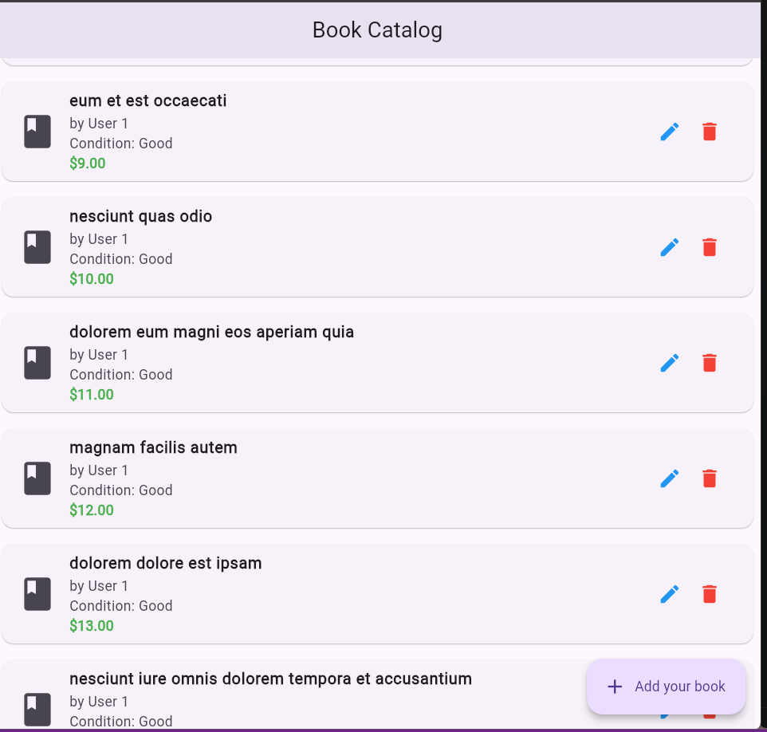
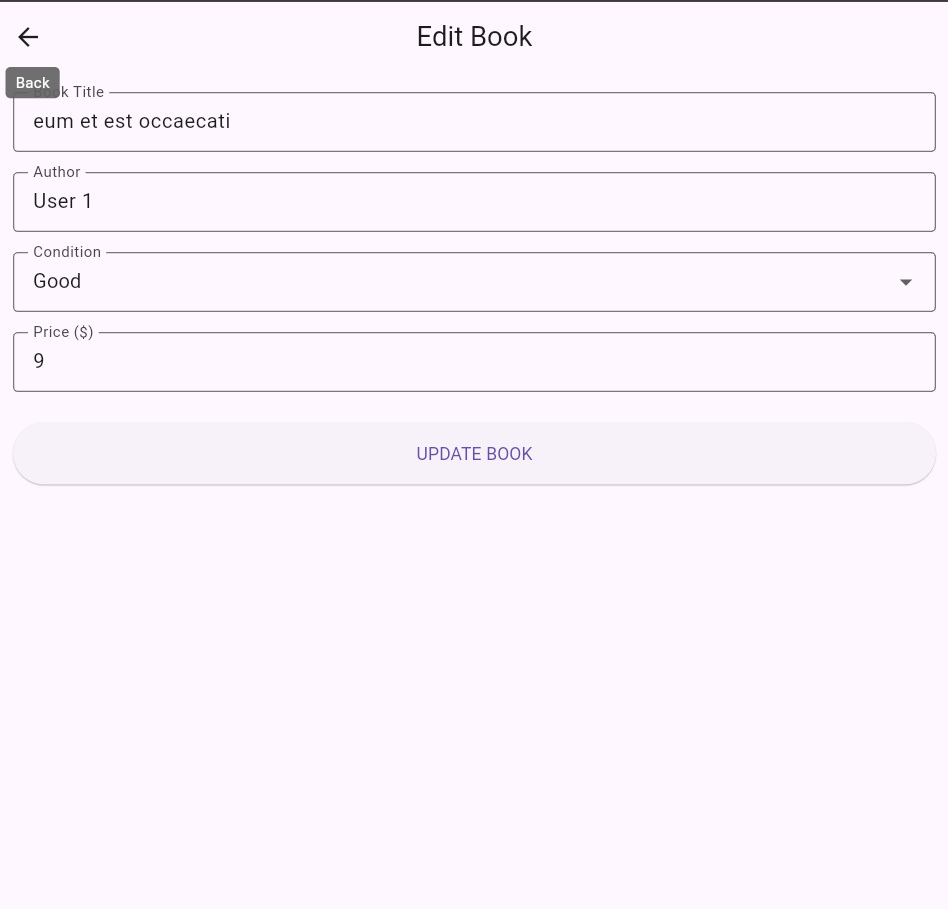
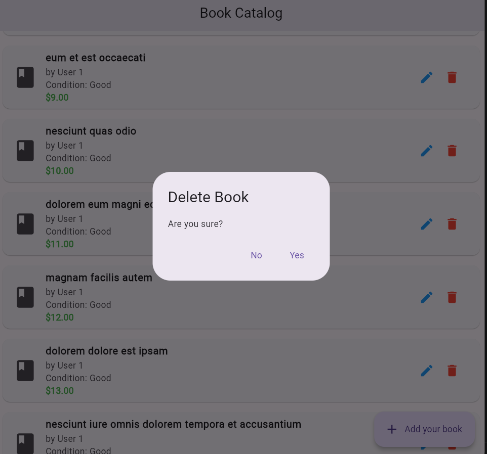
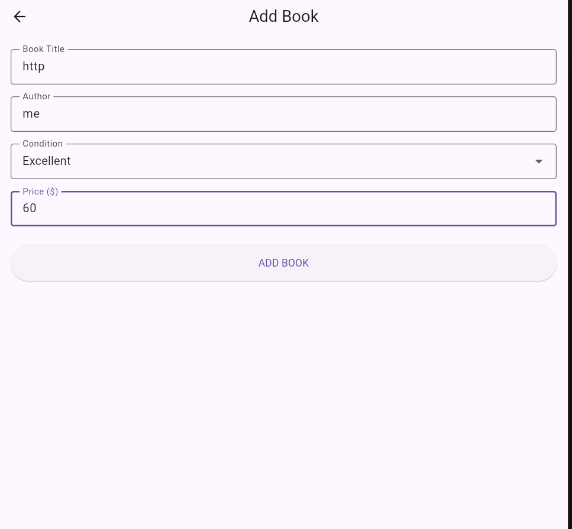

# book_catalog_app_using_http

A Flutter application that performs CRUD operations using Provider state management and HTTP requests.

## Features

- Create new book listings
- Read/view all books
- Update book details
- Delete book listings
- Loading states
- Error handling

## Screenshots




## Packages used
 
 - Flutter
 - Provider
 - HTTP 
 - JSONPLACEHOLDER

## Instructions to run
  ```bash
  flutter pub get
  flutter run 


